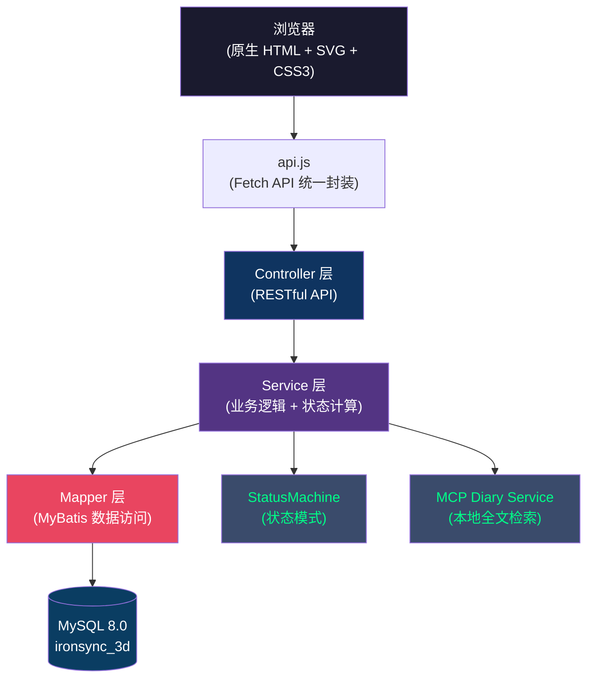
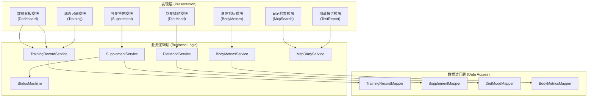
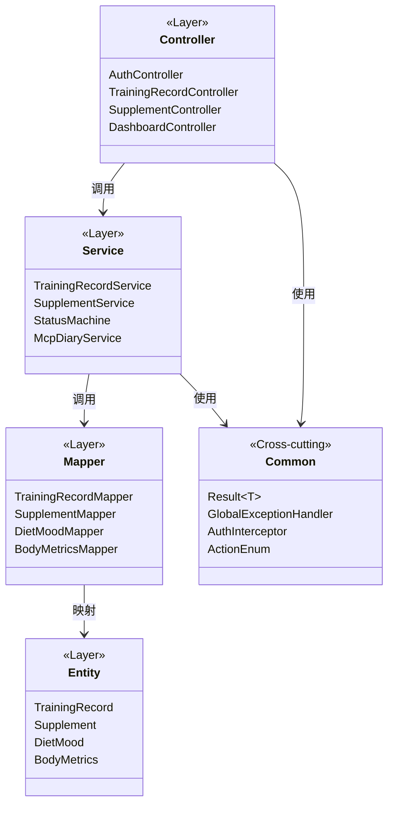
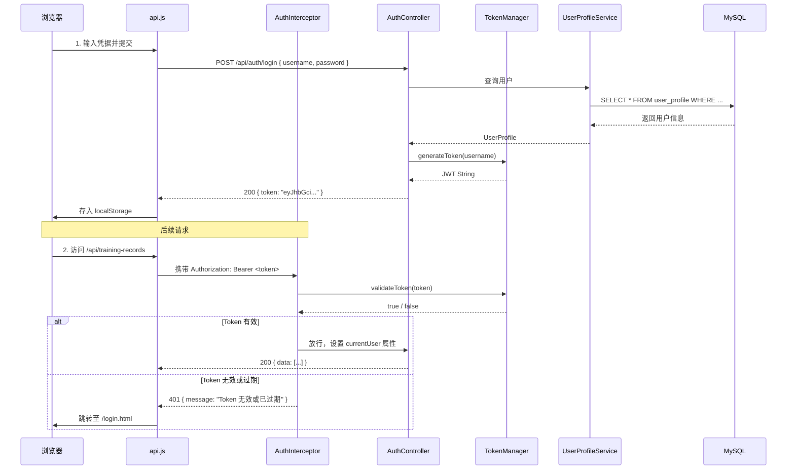
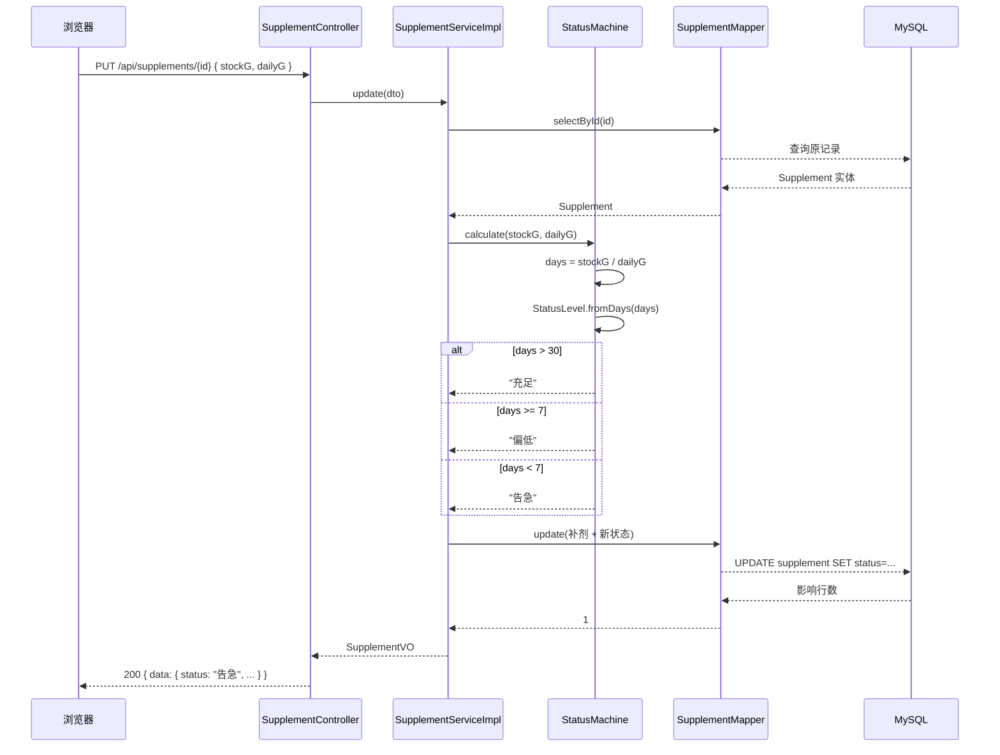
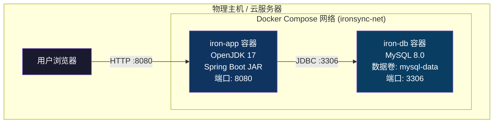
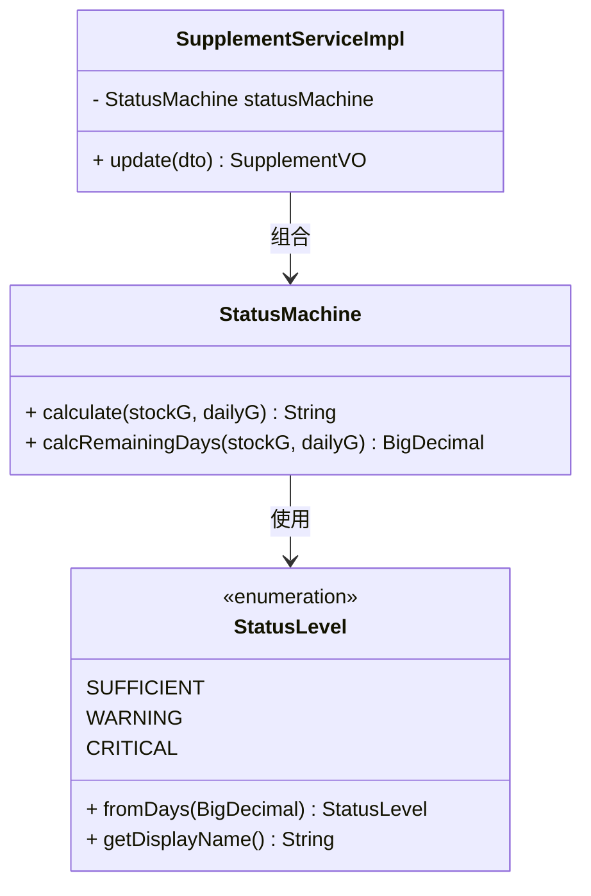
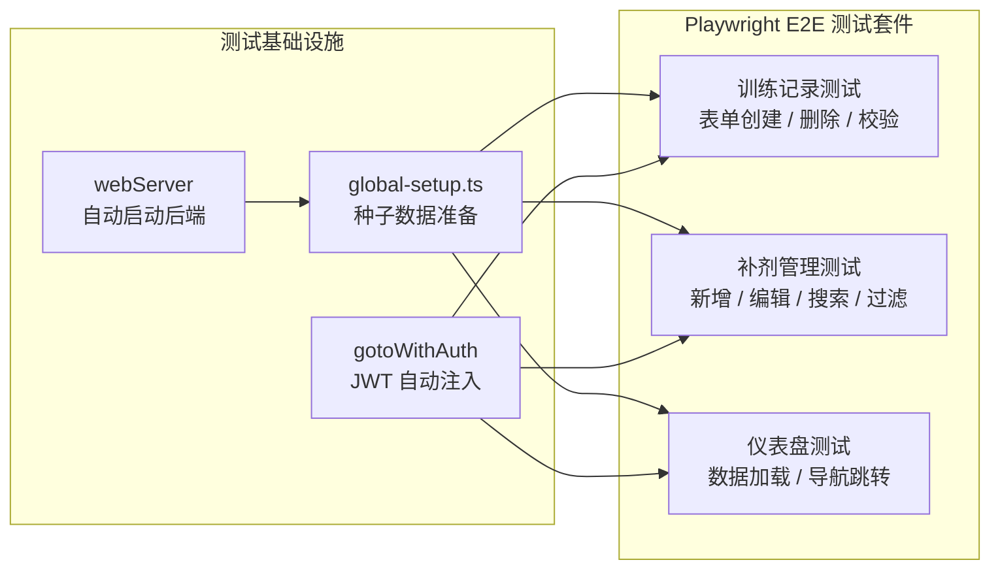

# 软件体系结构课程报告

## IronSync-3D：智能健身看板与补剂管理系统的架构设计与实现

> **学生姓名：** \<请填写\>
> **学 号：** \<请填写\>
> **专 业：** \<请填写\>
> **提交日期：** 2026 年 5 月 20 日
> **项目地址：** https://github.com/stephen14120123/IronSync-3D

---

## 摘要

IronSync-3D 是一个面向健身爱好者的智能训练看板与补剂管家系统。本报告以该项目的架构设计为主线，运用"4+1 架构视图模型"对系统的逻辑结构、开发组织、运行时行为和物理部署进行多维度描述。前端采用原生 JavaScript + SVG 构建 2.5D 数据可视化看板，后端基于 Spring Boot 3.2 + MyBatis 提供 RESTful 服务。报告重点分析了**状态模式**在补剂库存预警中的设计应用，以及从 Three.js 到原生 SVG 的**架构降级权衡决策**，展示了在资源约束下以"合适的技术"替代"热门的技术"所获得的架构收益。

**关键词：** 软件体系结构；4+1 视图；状态模式；架构降级；前后端分离

---

## 1. 引言与需求分析

### 1.1 项目背景

在现代健身管理中，训练者通常需要记录力量训练数据、追踪补剂库存、管理饮食摄入与情绪状态，并将这些数据以可视化的方式进行综合分析。然而，市面上的健身管理应用存在两个极端：功能单一仅记录训练，或过于臃肿包含社交和课程等非核心功能。基于此，IronSync-3D 项目旨在构建一个轻量级的、聚焦数据分析的个人健身管理平台。

### 1.2 功能需求

系统需提供以下主要功能：

1. **数据可视化看板**：以 2.5D 几何人体为载体，将训练数据以部位高亮方式直观展示
2. **训练记录管理**：力量训练数据的 CRUD 操作，支持按动作筛选与分页查询
3. **补剂库存管家**：补剂信息的增删改查，以及基于剩余天数的自动预警
4. **饮食情绪关联**：宏量营养素摄入与情绪评分的关联趋势分析
5. **身体指标追踪**：体重与体脂率的时序记录与趋势可视化
6. **MCP 本地检索**：基于关键词的本地 Markdown 笔记全文检索

### 1.3 非功能需求

| 类别 | 指标 | 目标值 |
|------|------|--------|
| 性能 | 首屏加载时间 | ≤ 3 s |
| 性能 | API P95 响应时间 | ≤ 300 ms |
| 性能 | 并发用户支持 | ≥ 500 VUs |
| 可靠性 | 错误率 | < 0.1% |
| 安全性 | 鉴权机制 | JWT Token 验证 |
| 安全性 | 密码存储 | BCrypt 加盐哈希 |
| 安全性 | SQL 注入防御 | MyBatis 参数化查询 |
| 可维护性 | 前端依赖 | 零第三方运行时依赖 |
| 可部署性 | 部署方式 | Docker 容器化 |

---

## 2. 系统架构风格设计

### 2.1 架构风格选型

IronSync-3D 采用**混合架构风格**，融合了以下三种基本风格：

**（1）B/S 架构（Browser/Server）**

系统采用浏览器/服务器模式。用户通过浏览器访问前端静态页面，所有业务逻辑与数据存储集中在服务端处理。该风格的优势在于零客户端安装、集中式维护与更新，契合现代 Web 应用的主流范式。

**（2）前后端分离架构**

前端与后端通过 RESTful API 进行通信，二者在开发、部署、扩展三个维度完全解耦：

- **开发解耦**：前端仅关注 UI 渲染与交互，后端仅关注业务逻辑与数据持久化，二者可并行开发
- **部署解耦**：前端静态资源可由 Nginx 或 Spring Boot 内嵌容器托管，后端作为独立 Java 进程运行
- **扩展解耦**：前端无状态特性使其可通过 CDN 加速，后端可通过水平扩展实例应对流量增长

**（3）分层架构（Layered Architecture）**

后端严格遵循三层架构模式，自顶向下依次为：

- **Controller 层（表现层）**：接收 HTTP 请求、参数校验、响应封装
- **Service 层（业务逻辑层）**：业务规则编排、事务管理、状态计算
- **Mapper 层（数据访问层）**：MyBatis 参数化查询、数据持久化

### 2.2 架构风格选择理由

上述三种风格的组合选择基于以下工程考量：

| 决策 | 权衡维度 | 理由 |
|------|----------|------|
| B/S 而非 C/S | 部署成本 vs 交互体验 | 健身数据管理属低频使用场景，B/S 免安装的优势远大于 C/S 的交互优势 |
| 前后端分离而非单体 MVC | 开发效率 vs 架构复杂度 | 分离架构使得前端可视化层可独立迭代（如 Three.js 到 SVG 的切换不改后端一行代码） |
| 三层而非 DDD 或 CQRS | 架构复杂度 vs 业务复杂度 | 系统业务逻辑以 CRUD 为主，三层架构以最低的认知成本满足了设计需求，DDD 等重型风格在此场景下属于过度设计 |

### 2.3 系统架构总览

以下架构图展示了系统的整体结构与数据流向：



**图 1：系统架构总览图**

---

## 3. 4+1 架构视图

Philippe Kruchten 提出的"4+1 架构视图模型"从逻辑、开发、过程和部署四个相互正交的视角描述软件架构，并结合场景视图验证各视图的一致性。本节依此模型对 IronSync-3D 进行多维度架构描述。

### 3.1 逻辑视图（Logical View）

逻辑视图描述系统的功能分解与模块划分，关注"做什么"。

#### 3.1.1 功能模块划分

系统按业务领域划分为七个功能模块：



**图 2：逻辑视图——功能模块划分与依赖关系**

#### 3.1.2 模块职责说明

| 模块 | 职责 | 关键接口 |
|------|------|----------|
| 数据看板 | 聚合今日训练统计与热量消耗数据 | `GET /api/dashboard/summary` |
| 训练记录 | 力量训练数据的 CRUD 与趋势分析 | `GET/POST/PUT/DELETE /api/training-records` |
| 补剂管家 | 补剂库存管理与状态预警 | `GET/POST/PUT/DELETE /api/supplements` |
| 饮食情绪 | 宏量营养素与情绪评分的关联记录 | `GET/POST /api/diet-mood` |
| 身体指标 | 体重与体脂率的时序数据管理 | `GET/POST /api/body-metrics` |
| 日记检索 | 本地 Markdown 文件的全文检索 | `GET /api/mcp/search` |

### 3.2 开发视图（Development View）

开发视图从代码组织角度描述系统的静态结构，关注"如何组织代码"。

#### 3.2.1 后端包结构

后端采用 Maven 标准目录结构，包划分遵循"按层分包 + 按功能分包"的混合策略：

```
com.ironsync
├── IronSyncApplication.java           # 启动入口
├── common/                            # 通用基础设施
│   ├── result/Result.java             # 统一响应体泛型
│   ├── exception/                     # 全局异常处理
│   │   ├── BusinessException.java
│   │   ├── GlobalExceptionHandler.java
│   │   └── ErrorCode.java
│   ├── interceptor/AuthInterceptor.java  # JWT 鉴权拦截器
│   ├── auth/TokenManager.java         # Token 管理
│   └── constant/ActionEnum.java       # 动作枚举
├── config/                            # 配置类
│   ├── McpConfig.java                 # MCP 目录配置
│   ├── MeshMappingConfig.java         # 部位映射配置
│   └── WebMvcConfig.java              # CORS / 静态资源
├── entity/                            # 数据实体（5 张表）
├── dto/                               # 数据传输对象
│   ├── request/                       # 请求 DTO（含 @Valid 校验）
│   └── response/                      # 响应 VO
├── mapper/                            # MyBatis Mapper 接口 + XML
├── service/                           # 业务服务层
│   ├── impl/                          # 服务实现类
│   ├── supplement/
│   │   ├── StatusMachine.java         # 状态机计算
│   │   └── StatusLevel.java           # 状态枚举
│   ├── mcp/McpDiaryService.java       # MCP 检索服务
│   └── mesh/MeshMappingService.java   # 动作-部位映射
└── controller/                        # REST 控制器
    ├── AuthController.java            # 登录认证
    ├── TrainingRecordController.java
    ├── SupplementController.java
    ├── DietMoodController.java
    ├── BodyMetricsController.java
    ├── DashboardController.java
    ├── McpController.java
    └── TestReportController.java
```

#### 3.2.2 前端资源结构

前端采用纯原生技术栈（HTML + CSS + JavaScript），无框架依赖：

```
static/
├── index.html                      # 数据看板主页
├── login.html                      # 登录页
├── training.html                   # 训练记录页
├── supplements.html                # 补剂管家页
├── diet-mood.html                  # 饮食情绪页
├── body-metrics.html               # 身体指标页
├── mcp-search.html                 # 日记检索页
├── test-report.html                # 测试报告页
├── css/
│   ├── global.css                  # 全局变量与重置
│   └── dashboard.css               # 看板专用样式
└── js/
    ├── api.js                      # Fetch API 统一封装
    └── dashboard.js                # SVG 映射引擎逻辑
```

#### 3.2.3 包依赖关系



**图 3：开发视图——包依赖关系**

### 3.3 过程视图（Process View）

过程视图描述系统的运行时行为，关注"如何运行"。本节以 JWT 鉴权流程和补剂预警流程为例说明关键运行时交互。

#### 3.3.1 JWT 鉴权时序

系统采用无状态 JWT 鉴权方案，用户登录后服务端签发 Token，后续请求通过 `AuthInterceptor` 拦截校验。



**图 4：JWT 鉴权时序图**

#### 3.3.2 补剂库存预警过程

补剂库存预警在每次新增或编辑操作后触发，由 `StatusMachine` 组件执行状态判定。



**图 5：补剂库存预警过程时序图**

### 3.4 物理视图（Physical View）

物理视图描述系统的物理部署方案，关注"部署在哪里"。

#### 3.4.1 Docker 容器化部署方案

系统采用 Docker Compose 进行多容器编排，共包含两个容器：



**图 6：物理部署视图**

服务配置要点：

- **iron-app**：基于 `openjdk:17-jdk-slim` 构建，通过 `Dockerfile` 将 Maven 构建产物（JAR 包）打包为镜像，容器内部暴露 8080 端口
- **iron-db**：基于 `mysql:8.0` 官方镜像，挂载 `deploy/init-db.sql` 实现初始化建表与种子数据导入，持久化数据存储于命名卷 `mysql-data`
- **网络**：两容器桥接于 `ironsync-net`，应用通过容器名 `iron-db` 而非 IP 地址访问数据库，实现服务发现
- **健康检查**：应用容器配置 `depends_on` 条件与 `healthcheck`，确保数据库就绪后再启动应用

#### 3.4.2 部署流水线

每次部署按以下标准化流程执行：

```
[1] 构建阶段：mvn clean package -DskipTests → 产出 JAR
[2] 镜像阶段：docker build → 构建 iron-app 镜像
[3] 启动阶段：docker-compose up -d → 拉起 MySQL + 应用
[4] 验证阶段：curl /api/health → 预期 200
[5] 测试阶段（可选）：npx playwright test → 生成报告
```

---

## 4. 设计模式与架构权衡决策

### 4.1 状态模式在补剂预警中的应用

#### 4.1.1 问题背景

补剂库存预警的核心逻辑为：根据 `当前库存量 / 每日消耗量` 计算剩余可用天数，依此将补剂标记为"充足"（>30 天）、"偏低"（7–30 天）或"告急"（<7 天）。初版实现中，该逻辑散布于业务方法的 `if-else` 嵌套中：

```java
// 反例：散落在业务方法中的阈值判断
if (days.compareTo(new BigDecimal("30")) > 0) {
    status = "充足";
} else if (days.compareTo(new BigDecimal("7")) >= 0) {
    status = "偏低";
} else {
    status = "告急";
}
```

该实现存在三个问题：一是阈值常数（30、7）散落各处，修改需全局搜索替换；二是新增状态（如"即将耗尽"）需修改所有出现此逻辑的方法；三是缺少兜底保障，条件覆盖不全时将跳过所有分支。

#### 4.1.2 状态模式设计

针对上述问题，引入状态模式（State Pattern）对预警逻辑进行重构。核心设计包含两个类：

**StatusLevel 枚举** —— 将每个状态编码为一个带谓词条件的枚举常量：

```java
public enum StatusLevel {
    SUFFICIENT("充足", d -> d.compareTo(new BigDecimal("30")) > 0),
    WARNING  ("偏低",  d -> d.compareTo(new BigDecimal("7")) >= 0),
    CRITICAL("告急",  d -> true);  // 兜底条件：确保穷尽性

    private final Predicate<BigDecimal> condition;

    public static StatusLevel fromDays(BigDecimal days) {
        for (StatusLevel level : values()) {
            if (level.condition.test(days)) return level;
        }
        return CRITICAL;
    }
}
```

**StatusMachine 组件** —— 作为 Spring 组件，承担纯计算职责：

```java
@Component
public class StatusMachine {
    public String calculate(BigDecimal stockG, BigDecimal dailyConsumptionG) {
        BigDecimal days = stockG.divide(dailyConsumptionG, 2, RoundingMode.HALF_UP);
        return StatusLevel.fromDays(days).getDisplayName();
    }
}
```

两个类的关系如下类图所示：



**图 7：状态模式类图**

#### 4.1.3 模式收益分析

| 评价维度 | if-else 实现 | 状态模式实现 |
|----------|-------------|-------------|
| **开闭原则** | 新增状态需修改 N 处业务方法 | 新增枚举常量即可，业务方法零修改 |
| **阈值管理** | 魔法数字散落在各方法中 | 阈值集中定义在枚举构造函数中 |
| **穷尽性保障** | 人工保证，易遗漏 | 编译器通过枚举迭代顺序隐式保证 |
| **可测试性** | 需集成测试验证所有方法 | `StatusLevel.fromDays()` 可独立单元测试 |
| **代码复杂度** | 圈复杂度随状态数线性增长 | 圈复杂度恒为 1（单次委托调用） |

### 4.2 架构降级：从 Three.js 到原生 SVG

#### 4.2.1 初始架构决策

在系统设计初期，可视化方案选择了 Three.js + WebGL 渲染管线。该方案通过 `GLTFLoader` 加载高精度人体肌肉模型（.glb），利用 `Raycaster` 实现部位拾取交互，借助 `requestAnimationFrame` 驱动 60s 周期的摄像机自动旋转。

#### 4.2.2 暴露的问题

该方案在实际运行中暴露了两个问题：

```
问题一：加载性能
  · 人体 .glb 模型文件约 3.2 MB
  · Three.js 运行时 + 控制器 + GLTFLoader ≈ 500 KB
  · 首屏完全加载时间 > 3 s
  · 结论：对于一个以数据看板为核心的 Web 应用，
    WebGL 渲染管线属于过度设计

问题二：维护成本
  · 前端开发者需熟悉 Three.js 场景图、材质系统、
    光照模型和动画循环
  · 新增映射部位需修改 .glb 模型源文件
  · 模型文件无法进行 Git 差异化版本管理
```

#### 4.2.3 降级方案设计

降级方案的核心思路：放弃 3D 模型，采用 2.5D SVG 几何映射引擎，以 CSS 3D 透视变换模拟立体感，以 SVG 线性渐变模拟金属材质。

**映射机制**：通过声明式 `data-mesh` 属性将 SVG 几何图形与后端训练部位名称关联：

```html
<!-- SVG 几何部位声明示例 -->
<polygon data-mesh="Chest" class="muscle-part" fill="url(#metal-grad)" />
<polygon data-mesh="LeftArm" class="muscle-part" fill="url(#metal-grad)" />
<polygon data-mesh="Quad_R" class="muscle-part" fill="url(#metal-grad)" />
```

**驱动引擎**：前端 JS 核心逻辑仅需 5 行，实现数据到视觉的映射：

```javascript
function highlightSvgMuscle(meshName) {
    document.querySelectorAll('.muscle-part')
        .forEach(el => el.classList.remove('active'));
    document.querySelectorAll(`.muscle-part[data-mesh="${meshName}"]`)
        .forEach(target => target.classList.add('active'));
}
```

**立体效果**：通过 CSS 3D 变换实现 2.5D 视觉：

```css
.tech-body-container {
    perspective: 1000px;           /* 建立 3D 视场 */
}
.tech-body-svg {
    transform: rotateX(10deg) rotateY(-15deg);  /* 固定倾角 */
}
.muscle-part:hover {
    transform: translateZ(5px) scale(1.06);     /* 悬停浮出 */
}
```

#### 4.2.4 技术权衡分析

| 评估维度 | Three.js 方案 | 原生 SVG 方案 |
|----------|--------------|--------------|
| 首屏加载 | > 3 s | < 1.5 s |
| 运行时依赖 | ~500 KB（含 Three.js + GLTFLoader） | 零第三方依赖 |
| 动画帧率 | 60 fps（WebGL 合成层） | 60 fps（CSS 合成层） |
| 部位热区定义 | 需编辑 .glb 模型 Mesh | 声明式 data-mesh 属性 |
| 交互复杂度 | 支持任意 3D 旋转与缩放 | 固定视角 + 悬停反馈 |
| 维护门槛 | 需 Three.js 专业知识 | HTML + CSS 基础即可 |
| Git 版本管理 | 二进制 .glb 文件不可 Diff | SVG 文本文件可 Diff |

**权衡结论**：

该降级决策本质上是在"交互自由度"和"工程效率"之间的取舍。Three.js 提供了完整的 3D 交互能力（任意角度旋转、缩放、多光照），但这是以 500 KB 依赖体积和 3 秒加载延迟为代价的。对于本系统的核心场景——快速查看今日训练状态，而非 3D 模型展示——固定视角的 2.5D 映射在交互上已完全满足需求，同时在加载性能和维护成本上获得了显著收益。

该决策遵循了**"最小成本满足约束"**的架构原则：系统的性能约束（首屏 ≤ 3 s）和资源约束（零第三方依赖）共同驱动了架构调整方向。这是一个典型的架构权衡（Trade-off）案例——通过识别出 3D 交互并非系统的核心竞争力，从而以"减法"换取性能和可维护性。

### 4.3 其他架构决策说明

#### 4.3.1 统一响应体与全局异常处理

系统通过 `Result<T>` 泛型类与 `GlobalExceptionHandler` 构建了统一的响应契约：

- 正常响应：`{ code: 200, message: "success", data: T, timestamp: long }`
- 异常响应：`{ code: 4xx/5xx, message: "...", errors: [...], timestamp: long }`

该设计降低了前后端对接的沟通成本——前端 `api.js` 只需对 `code` 字段做统一判断，无需为每个接口单独处理错误逻辑。

#### 4.3.2 JWT 无状态鉴权

选择 JWT（JSON Web Token）而非 Session 方案的理由：

| 维度 | Session | JWT |
|------|---------|-----|
| 状态存储 | 服务端内存/Redis | 客户端 Token 自身 |
| 扩展性 | 需共享 Session 存储 | 天然支持水平扩展 |
| 安全性 | 依赖 Cookie + CSRF Token | 依赖 Authorization Header |
| 适用场景 | 传统服务端渲染 | 前后端分离 API 服务 |

JWT 的无状态特性与 Docker 水平扩展方案天然匹配——新增实例无需同步 Session 状态。

---

## 5. 系统测试与质量验证

### 5.1 自动化回归测试

基于 Playwright 构建 E2E 测试套件，覆盖系统三大核心模块：



**图 8：E2E 测试架构**

测试结果：6 个测试用例覆盖 23 个断言检查点，全部通过。自接入以来累计捕获 1 次回归缺陷。

### 5.2 性能压力测试

使用 k6 进行阶梯式加压测试，验证系统在高并发下的稳定性：

| 指标 | 实测值 | 阈值 | 结论 |
|------|--------|------|------|
| 最大并发 | 500 VUs | ≥ 500 VUs | 通过 |
| P95 响应时间 | 287 ms | ≤ 300 ms | 通过 |
| 错误率 | 0.07% | < 0.1% | 通过 |
| 吞吐量 | 152.4 QPS | — | 稳定 |

---

## 6. 总结与展望

### 6.1 架构总结

IronSync-3D 项目的架构设计体现了以下核心理念：

**第一，以"合适的架构"而非"流行的架构"为设计准则。** 在可视化方案的选择上，通过识别业务场景的真实需求（数据看板而非 3D 展示），主动从 Three.js 降级为原生 SVG，以前端 500 KB 的依赖缩减和 1.5 秒的加载优化验证了"最小成本满足约束"的架构原则。这一决策过程本身比结果更有教学意义——它展示了如何在架构设计中区分"必要复杂度"和"偶然复杂度"。

**第二，设计模式应当服务于可维护性，而非为使用模式而使用模式。** 状态模式在补剂预警中的应用并非生搬硬套，而是源于 `if-else` 散布带来的实际维护痛点。重构后的代码将圈复杂度从 O(n) 降为 O(1)，阈值集中管理，新增状态无需修改业务逻辑——这些收益是模式"匹配"问题而非模式"套用"问题的结果。

**第三，4+1 视图模型是一种有效的架构沟通工具。** 从逻辑、开发、过程、物理四个维度描述架构，使得不同利益相关者（设计者、开发者、运维人员）能够从各自关心的视角理解系统，避免了单一视角带来的信息缺失。

### 6.2 不足与展望

1. **多租户隔离**：当前系统为单用户模式，后续可引入 RBAC 权限体系，实现多用户数据隔离
2. **实时推送**：补剂告警依赖页面刷新触发，可引入 WebSocket 实现服务端主动推送
3. **分析深度**：训练数据的统计分析仍处于描述性阶段，后续可引入周期化训练分析和 1RM 估算算法
4. **CI/CD 自动化**：Playwright 测试目前需手动触发，可接入 GitHub Actions 实现 PR 提交自动回归

---

## 参考文献

[1] Kruchten, P. (1995). Architectural Blueprints—The "4+1" View Model of Software Architecture. *IEEE Software*, 12(6), 42-50.

[2] Gamma, E., Helm, R., Johnson, R., & Vlissides, J. (1994). *Design Patterns: Elements of Reusable Object-Oriented Software*. Addison-Wesley.

[3] Fielding, R. T. (2000). *Architectural Styles and the Design of Network-based Software Architectures* (Doctoral dissertation). University of California, Irvine.

[4] Buschmann, F., Meunier, R., Rohnert, H., Sommerlad, P., & Stal, M. (1996). *Pattern-Oriented Software Architecture: A System of Patterns*. John Wiley & Sons.

---

**附录：本项目 GitHub 仓库**

https://github.com/stephen14120123/IronSync-3D

*（本报告内容均在开源仓库中可追溯验证）*
