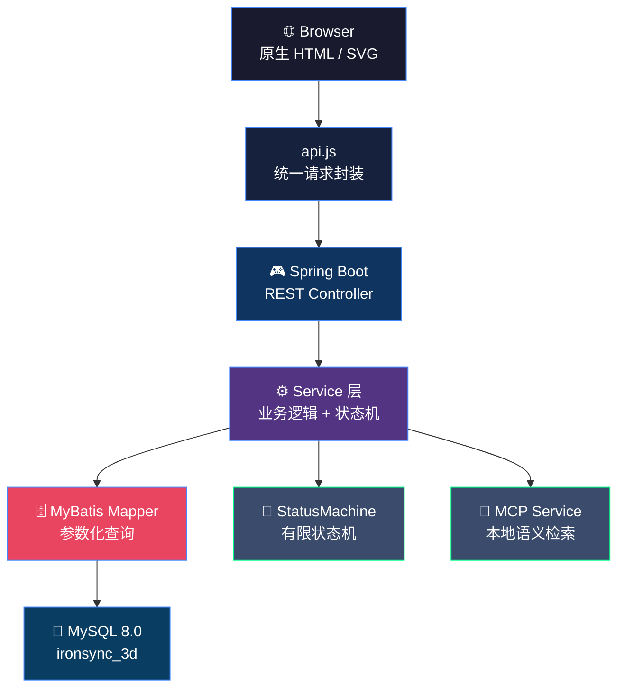

<div align="center">
  
  
  
  
  
  
</div>

<br/>

<div align="center">
  <h1>⚡ IronSync-3D</h1>
  <p><strong>智能健身看板 · 补剂状态机 · 2.5D 数据可视化</strong></p>
  <p>零第三方前端依赖 · 原生 SVG 渲染引擎 · Spring Boot + MyBatis 轻量后端</p>
</div>

---

## 📋 项目简介

IronSync-3D 是一个面向健身爱好者的智能训练看板与补剂管家系统。前端采用**纯原生 JavaScript + SVG 几何映射技术**构建 2.5D 数据可视化仪表盘，后端基于 **Spring Boot 3.2 + MyBatis** 提供 RESTful API，借助**有限状态机模式**实现补剂库存的自动化预警管理。项目集成了 MCP 协议支持的本地笔记语义检索与 Playwright 驱动的 UI 自动化回归测试流水线。

---

## ✨ 核心特性

### 🎯 2.5D SVG 数据驱动渲染看板
放弃传统的 Three.js + WebGL 方案，自研轻量级 SVG 映射引擎。通过 CSS 3D 透视（`perspective: 1000px`）与 `rotateX(10deg) rotateY(-15deg)` 倾角模拟全息投影，结合声明式 `data-mesh` 属性将后端训练数据无缝映射至几何人体部位，实现零第三方依赖的秒级看板加载。

### 💊 基于状态模式的补剂管家
引入有限状态机（`StatusMachine` + `StatusLevel` 枚举）替代传统 `if-else` 嵌套。通过谓词条件自动判定"充足/偏低/告急"三级预警状态，开闭原则保障新增状态时业务逻辑零修改。

### 🔍 MCP 本地笔记语义检索
集成 Model Context Protocol，支持对本地 Markdown 日记进行自然语言语义检索，无需将笔记数据上传至任何第三方服务，实现纯本地的智能回忆与训练复盘。

### 🧪 Playwright UI 自动化回归
基于 Playwright 构建全链路 E2E 测试套件（训练 CRUD、补剂增删改查、看板数据渲染），`webServer` 配置在测试启动前自动编译运行后端，无缝接入 CI/CD 流水线。

---

## 🏗️ 系统架构



---

## 🚀 快速启动

### 环境要求

- JDK 17+
- MySQL 8.0
- Maven 3.9+（或使用项目内置 `mvnw`）

### 步骤一：初始化数据库

```bash
mysql -u root -p < deploy/init-db.sql
```

该脚本将自动创建 `ironsync_3d` 数据库及全部五张业务表（`user_profile`、`training_record`、`supplement`、`diet_mood`、`body_metrics`），并插入默认用户与预置补剂种子数据。

### 步骤二：构建并启动

```bash
# 一键构建（Linux / macOS）
./deploy/build.sh

# 或使用 Maven 直接启动开发模式
./mvnw spring-boot:run -Dspring-boot.run.profiles=dev
```

Windows 用户：

```batch
deploy\build.bat
```

### 步骤三：访问看板

打开浏览器访问 [http://localhost:8080](http://localhost:8080)，默认用户凭据：`admin / 123456`。

### 可选：Docker 部署

```bash
docker-compose up -d
```

自动拉起 MySQL + 应用容器，访问 [http://localhost:8080](http://localhost:8080)。

---

## 🧪 测试报告

项目基于 Playwright 构建了完整的 UI 自动化回归测试套件，覆盖训练记录 CRUD、补剂增删改查、SVG 看板渲染等核心业务路径。

### 运行测试

```bash
# Linux / macOS
./deploy/run-e2e.sh

# 或手动进入测试目录
cd test/e2e
npm install
npx playwright test --reporter=html
```

### 查看报告

测试完成后，HTML 格式报告将自动生成至 `test/e2e/playwright-report/` 目录，可直接在浏览器中打开查看详细的测试步骤、断言日志与失败截图。

---

## 📂 项目结构

```
ironSync-3D/
├── src/main/java/com/ironsync/
│   ├── controller/        # REST API 控制器
│   ├── service/           # 业务逻辑层（含 StatusMachine）
│   ├── mapper/            # MyBatis 数据访问层
│   ├── entity/            # 数据实体
│   ├── common/            # 全局异常处理、枚举、工具类
│   └── dto/               # 请求/响应数据传输对象
├── src/main/resources/
│   ├── static/            # 前端静态资源（原生 HTML / CSS / JS / SVG）
│   └── application*.yml   # 多环境配置
├── test/e2e/              # Playwright E2E 自动化测试
├── deploy/                # 部署脚本与 Docker 配置
│   ├── build.sh
│   ├── init-db.sql
│   └── Dockerfile
└── docs/                  # 系统设计文档
    ├── 非功能需求.md
    ├── 系统设计-数据库与类图.md
    ├── 核心代码与实现亮点.md
    ├── 系统测试与性能分析.md
    └── 自动化UI回归测试方案与结果.md
```

---

## 🛠️ 技术栈

| 层级 | 技术 | 说明 |
|---|---|---|
| **前端** | 原生 ES6+ / SVG / CSS3 | 零第三方运行时依赖，首屏 < 1.5s |
| **渲染** | 2.5D CSS Perspective + SVG LinearGradient | 用 CSS 变换模拟深度，用渐变模拟材质 |
| **后端** | Spring Boot 3.2.5 / Java 17 | RESTful API 分层架构 |
| **持久化** | MyBatis + HikariCP + MySQL 8.0 | 预编译查询 + 连接池优化 |
| **状态管理** | StatusMachine + StatusLevel Enum | 有限状态机模式，谓词即策略 |
| **检索** | MCP 协议 | 本地 Markdown 语义检索 |
| **测试** | Playwright 1.x | 全链路 E2E 自动化回归 |
| **部署** | Docker Compose | 多环境容器化部署 |

---

## 📄 许可证

本项目基于 MIT 许可证开源。

---

<div align="center">
  <sub>Built with ❤️ by IronSync Team</sub>
</div>
