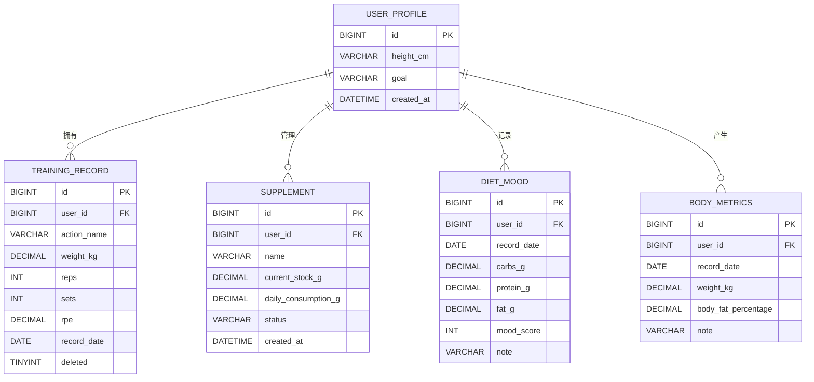
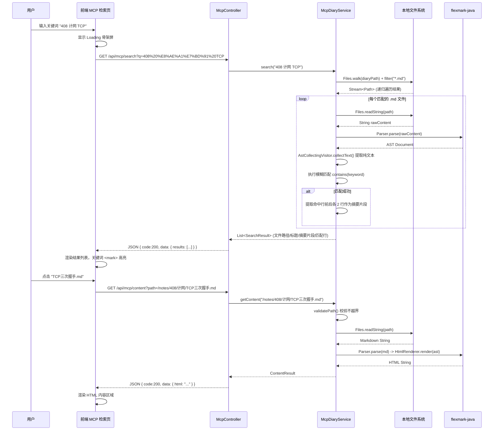
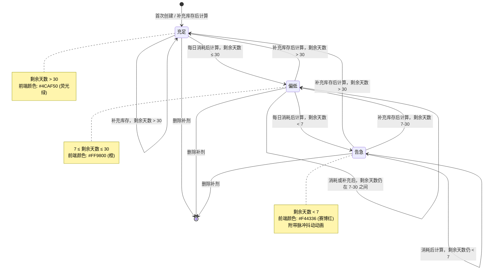

# IronSync-3D 系统详细设计与 UI 规范文档

> 本文档是 IronSync-3D 项目的详细设计蓝图，直接指导后续的 SQL 建表、Java 后端编码、前端 JS/HTML/CSS 开发以及 CI/CD 部署脚本编写。请严格以此为唯一参考。

---

## 一、核心用户场景设计 (User Scenarios)

### 场景一：晚间力量训练闭环

**覆盖模块**：PRD 2.1（3D 数据大屏主页）、2.2（核心训练记录页）、2.7（身体指标看板）、3.1（3D 数据联动高亮）、3.2（训练日志 CRUD）

**触发时机**：用户完成当日腿部训练（杠铃深蹲 5×5 + 罗马尼亚硬拉 4×8）后，打开 IronSync-3D 录入数据。

**操作步骤与系统反馈**：

| 步骤 | 用户操作 | 后台处理逻辑 | 前端视觉反馈 |
|------|----------|-------------|-------------|
| 1 | 进入「核心训练记录页」2.2，选择动作「杠铃深蹲」 | — | 表单预填默认组数，折线图区域定位到深蹲历史曲线 |
| 2 | 录入：重量 120kg、组数 5、次数 5、RPE 8，点击提交 | `POST /api/training-records` → DTO 校验（重量>0, RPE∈[1,10]） → MyBatis `insert` → 返回 201 | 表单重置，历史列表顶部出现新记录，折线图自动追加数据点并重新拟合曲线 |
| 3 | 重复步骤 1-2，录入「罗马尼亚硬拉」重量 100kg、组数 4、次数 8、RPE 7 | 同上 | 硬拉折线图同步更新；底部 TOAST 提示"今日训练已记录 2 个动作" |
| 4 | 切换至「身体指标看板」2.7，录入当日体重 78.5kg、体脂率 12% | `POST /api/body-metrics` → DTO 校验（体重∈[20,300]） → `insert or update`（每日一条） | 体脂率折线图新增数据点；表单重置 |
| 5 | 返回「3D 数据大屏主页」2.1 | 页面加载时自动调用 `GET /api/training-records/today` | 3D 人体模型腿部 Mesh 由默认灰 → 红色渐变高亮（`color.setHSL(0, 0.7, 0.5)` + 脉动发光），下背部同时高亮；左侧卡片更新今日组数总计 57 组 |
| 6 | 鼠标悬停腿部高亮区域 | — | 弹出 Tooltip："杠铃深蹲 — 5组 × 5次，今日最大重量 120kg" |
| 7 | 鼠标拖拽旋转视角 | — | 摄像机跟随鼠标变换角度，高亮部位保持可见 |

**关键实体交互**：`training_record.action_name` → `MeshMappingService` → 映射表 `{"杠铃深蹲": ["左大腿", "右大腿", "臀部"], "罗马尼亚硬拉": ["下背部", "腘绳肌"]}` → Three.js `mesh.material.color`

---

### 场景二：营养摄入与情绪追踪

**覆盖模块**：PRD 2.3（营养与补剂管家）、2.4（状态关联分析页）、3.3（补剂库存预警）、3.4（饮食情绪关联）

**触发时机**：用户发现酵母蛋白即将见底，且当日碳水摄入较低导致情绪低落，需要同时管理补剂库存和记录饮食情绪。

**操作步骤与系统反馈**：

| 步骤 | 用户操作 | 后台处理逻辑 | 前端视觉反馈 |
|------|----------|-------------|-------------|
| 1 | 进入「营养与补剂管家」2.3，浏览补剂卡片列表 | `GET /api/supplements` → 返回全部补剂及当前状态 | 卡片按状态排序（告急 > 偏低 > 充足）；酵母蛋白卡片进度条剩余 12%，标签显示「偏低」 |
| 2 | 点击酵母蛋白卡片上的「编辑」，将库存量从 50g 修改为 30g | `PUT /api/supplements/{id}` → 服务器重算剩余天数 = 30/25 ≈ 1.2 天 → 状态跃迁「告急」 | 卡片状态标签由橙色「偏低」→ 红色「告急」并附带脉冲抖动动画；进度条红色警示 |
| 3 | 点击「新增补剂」，录入「甘氨酸镁」200g、每日消耗 3g | `POST /api/supplements` → 默认状态计算 → `insert` | 新卡片出现，状态「充足」（200/3 ≈ 66 天 > 30） |
| 4 | 切换至「状态关联分析页」2.4，选择今日日期，设置宏量营养素：碳水 85g、蛋白质 160g、脂肪 50g | `POST /api/diet-mood` → 校验日期不超今日 → `insert or update` | 双 Y 轴图表在今日 X 轴位置新增数据点 |
| 5 | 在情绪评分栏拖动滑块至 4，备注"低碳日精神状态差"，提交 | 合并至同一条 `diet_mood` 记录 | 情绪折线图在今日位置显示评分 4，数据点以特殊警示色标记 |
| 6 | 将日期范围选择器拉至近 2 周 | `GET /api/diet-mood?from=...&to=...` | 图表整体缩放到 14 天视图，可观察到碳水低点与情绪评分低谷的正相关性 |

**补剂状态机说明**：每次 `PUT`/`POST` 操作均在 Service 层调用 `StatusMachine.calculate(daysRemaining)`，结果回写 `supplement.status` 字段，前端不参与状态判定逻辑。

---

### 场景三：知识复盘与回归测试查阅

**覆盖模块**：PRD 2.5（MCP 本地日记检索页）、2.6（自动化测试与设置页）、3.5（MCP 轻量化方案）、3.6（Playwright CI/CD）

**触发时机**：用户刚执行完一次 CI/CD 部署，想查阅 Playwright 测试结果，同时需要回顾本地笔记中关于计网的知识点。

**操作步骤与系统反馈**：

| 步骤 | 用户操作 | 后台处理逻辑 | 前端视觉反馈 |
|------|----------|-------------|-------------|
| 1 | 进入「MCP 本地日记检索页」2.5，在搜索框输入"408 计网 TCP" | `GET /api/mcp/search?q=408+计网+TCP` → `McpDiaryService.treeWalk()` 使用 `Files.walk()` 遍历笔记目录 → flexmark-java 解析 `.md` 文件为 AST → 提取纯文本后执行 `String.contains()` 模糊匹配 | 搜索框下方出现 Loading 骨骼骨架屏，1.5s 后展示结果列表 |
| 2 | 结果列表显示 3 条匹配记录，分别为「408/计网/传输层.md」「408/计网/TCP三次握手.md」「日记/2024-09-15-学习记录.md」 | — | 每条结果展示文件路径（灰色）、标题、匹配片段（关键词 `<mark>` 高亮） |
| 3 | 点击「TCP三次握手.md」条目 | `GET /api/mcp/content?path=...` → 路径穿越校验 → `Files.readString()` + flexmark-java 渲染 HTML | 右侧或下方展开完整 Markdown 渲染内容（代码块格式保留） |
| 4 | 切换至「自动化测试与设置页」2.6 | `GET /api/test/report/latest` → 返回最新报告元数据 | 左侧徽章面板显示：2026-05-14 10:23，总计 6 用例，通过 5，失败 1 |
| 5 | 右侧 iframe 自动加载 `test-reports/index.html` | 静态资源映射直接提供该文件 | iframe 内展示 Playwright HTML 报告的完整页面，包含测试步骤截图和失败堆栈 |
| 6 | 查看失败用例详情 | — | 报告中展示失败截图：某表单提交时 RPE 字段校验未通过，定位到 DTO 校验边界问题 |

**MCP 安全约束**：`McpDiaryService.validatePath()` 使用 `Path.normalize()` + `startsWith()` 校验请求路径不可越出 `ironsync.mcp.diary-path` 配置的根目录。

---

## 二、数据库概念与逻辑模型设计 (Data Model Design)

### 2.1 E-R 图



### 2.2 数据字典

#### user_profile（用户信息）

| 字段名 | 数据类型 | 主键 | 外键 | 非空 | 默认值 | 说明 |
|--------|---------|------|------|------|--------|------|
| id | BIGINT | PK | — | Y | AUTO_INCREMENT | 用户主键 |
| height_cm | DECIMAL(5,1) | — | — | Y | — | 身高（cm），校验范围 50-250 |
| goal | VARCHAR(100) | — | — | N | NULL | 训练目标，如「增肌」「减脂」「力量举」 |
| created_at | DATETIME | — | — | Y | CURRENT_TIMESTAMP | 注册时间 |

#### training_record（训练记录）

| 字段名 | 数据类型 | 主键 | 外键 | 非空 | 默认值 | 说明 |
|--------|---------|------|------|------|--------|------|
| id | BIGINT | PK | — | Y | AUTO_INCREMENT | 记录主键 |
| user_id | BIGINT | — | Y | Y | — | 所属用户，FK → user_profile.id |
| action_name | VARCHAR(50) | — | — | Y | — | 动作名称（下拉枚举），如「杠铃深蹲」「罗马尼亚硬拉」「卧推」「推举」「引体向上」 |
| weight_kg | DECIMAL(5,1) | — | — | Y | — | 使用重量（kg），范围 1-999 |
| reps | INT | — | — | Y | — | 每组次数，≥ 1 |
| sets | INT | — | — | Y | — | 组数，范围 1-50 |
| rpe | DECIMAL(2,1) | — | — | Y | — | RPE 自感用力度（1.0-10.0），步进 0.5 |
| record_date | DATE | — | — | Y | — | 训练日期，不可为未来日期 |
| deleted | TINYINT | — | — | Y | 0 | 逻辑删除标志（0=正常，1=已删除） |

#### supplement（补剂库存）

| 字段名 | 数据类型 | 主键 | 外键 | 非空 | 默认值 | 说明 |
|--------|---------|------|------|------|--------|------|
| id | BIGINT | PK | — | Y | AUTO_INCREMENT | 补剂主键 |
| user_id | BIGINT | — | Y | Y | — | 所属用户，FK → user_profile.id |
| name | VARCHAR(50) | — | — | Y | — | 补剂名称 |
| current_stock_g | DECIMAL(8,2) | — | — | Y | — | 当前库存总量（g） |
| daily_consumption_g | DECIMAL(6,2) | — | — | Y | — | 每日消耗量（g） |
| status | VARCHAR(10) | — | — | Y | '充足' | 预警状态（「充足」「偏低」「告急」），由 Service 层计算写入 |
| created_at | DATETIME | — | — | Y | CURRENT_TIMESTAMP | 创建时间 |

#### diet_mood（饮食情绪）

| 字段名 | 数据类型 | 主键 | 外键 | 非空 | 默认值 | 说明 |
|--------|---------|------|------|------|--------|------|
| id | BIGINT | PK | — | Y | AUTO_INCREMENT | 记录主键 |
| user_id | BIGINT | — | Y | Y | — | 所属用户，FK → user_profile.id |
| record_date | DATE | — | — | Y | — | 记录日期（每日一条约束），不可为未来日期 |
| carbs_g | DECIMAL(6,1) | — | — | Y | — | 碳水化合物摄入量（g） |
| protein_g | DECIMAL(6,1) | — | — | Y | — | 蛋白质摄入量（g） |
| fat_g | DECIMAL(6,1) | — | — | Y | — | 脂肪摄入量（g） |
| mood_score | INT | — | — | Y | — | 情绪评分（1-10） |
| note | VARCHAR(500) | — | — | N | NULL | 备注/自由文本 |

#### body_metrics（身体指标）

| 字段名 | 数据类型 | 主键 | 外键 | 非空 | 默认值 | 说明 |
|--------|---------|------|------|------|--------|------|
| id | BIGINT | PK | — | Y | AUTO_INCREMENT | 记录主键 |
| user_id | BIGINT | — | Y | Y | — | 所属用户，FK → user_profile.id |
| record_date | DATE | — | — | Y | — | 记录日期（每日一条约束），不可为未来日期 |
| weight_kg | DECIMAL(5,2) | — | — | Y | — | 体重（kg），范围 20-300 |
| body_fat_percentage | DECIMAL(4,1) | — | — | N | NULL | 体脂率（%），范围 3.0-60.0 |
| note | VARCHAR(500) | — | — | N | NULL | 备注 |

### 2.3 索引设计

```sql
-- 1. 训练记录复合索引：按日期和动作快速筛选趋势数据
CREATE INDEX idx_training_date_action
    ON training_record (record_date, action_name);

-- 2. 饮食情绪唯一索引：确保每日一条约束
CREATE UNIQUE INDEX idx_diet_mood_date
    ON diet_mood (user_id, record_date);

-- 3. 身体指标唯一索引：确保每日一条约束
CREATE UNIQUE INDEX idx_body_metrics_date
    ON body_metrics (user_id, record_date);
```

---

## 三、核心业务流转设计 (Functional Flow & Sequence)

### 3.1 3D 数据联动渲染流程

```mermaid
flowchart TD
    A[用户打开 3D 数据大屏主页] --> B[Three.js 初始化 Scene / Camera / Renderer]
    B --> C[GLTFLoader 异步加载人体 .glb 模型]
    C --> D{模型加载成功?}

    D -- Yes --> E[遍历模型 Scene.children，建立部位 -> Mesh 名称索引表]
    D -- No --> F[渲染线框 placeholder 人体，console.warn 输出加载失败]

    E --> G[并发请求 GET /api/training-records/today]
    F --> G

    G --> H{今日有训练记录?}

    H -- Yes --> I[解析响应获取 action_name 列表]
    I --> J[查询部位映射表: e.g. 杠铃深蹲 -> [左大腿Mesh, 右大腿Mesh, 臀部Mesh]]
    J --> K[遍历匹配的 Mesh 节点]
    K --> L[材质颜色切换: color.setHSL(0, 0.7, 0.5) + 脉动发光动画 loop]
    L --> M[左侧卡片更新: 动作数/总组数/RPE 均值]
    M --> N[右侧卡片更新: 热量消耗环形进度]

    H -- No --> O[模型保持默认灰色材质]
    O --> P[渲染引导提示: 今日尚未记录训练]

    N --> Q[requestAnimationFrame 启动摄像机 60s 自转]
    P --> Q

    Q --> R[添加 OrbitControls 支持鼠标拖拽交互]
    R --> S[注册 Raycaster 悬停事件 -> Tooltip 展示组数详情]
```

### 3.2 MCP 本地检索时序图



### 3.3 补剂状态机逻辑



### 3.4 异常拦截与统一响应流转

```mermaid
flowchart LR
    subgraph 前端请求
        A[Fetch API 调用后端接口] --> B[JSON 请求体]
    end

    subgraph Controller 层
        B --> C[TrainingRecordController]
        C --> D[DTO @Valid 校验]
    end

    subgraph 校验分支
        D --> E{校验通过?}
        E -- Yes --> F[调用 Service 层业务逻辑]
        E -- No --> G[抛出 MethodArgumentNotValidException]
    end

    subgraph Service 层
        F --> H[TrainingRecordService]
        H --> I[MyBatis Mapper 执行 SQL]
    end

    subgraph 全局异常处理
        G --> J[GlobalExceptionHandler]
        I -- 数据库异常 --> K[DataAccessException]
        K --> J
        H -- 业务异常 --> L[自定义 BusinessException]
        L --> J
    end

    subgraph 统一响应封装
        J --> M[组装 Result<T> 泛型对象]
        M --> N{异常类型判断}
        N -- 校验异常 --> O[Result.error(400, "...", fieldErrors)]
        N -- 业务异常 --> P[Result.error(code, message, null)]
        N -- 系统异常 --> Q[Result.error(500, "服务器内部错误", null)]
        N -- 正常 --> R[Result.success(data)]
    end

    subgraph 响应返回
        O --> S[JSON: {code, message, errors, timestamp}]
        P --> S
        Q --> S
        R --> T[JSON: {code:200, message:"success", data, timestamp}]
    end

    S --> U[前端捕获 HTTP 4xx/5xx 处理]
    T --> U
    U --> V[前端根据 code 字段渲染结果/错误提示]
```

---

## 四、UI 组件化设计与 CSS 布局规范 (UI/UX Specification)

### 4.1 全局视觉基调

| 令牌 | 值 | 用途 |
|------|-----|------|
| `--bg-primary` | `#121212` | 主背景色 |
| `--bg-card` | `#1E1E1E` | 卡片背景 |
| `--bg-glass` | `rgba(30, 30, 30, 0.75)` | 毛玻璃卡片背景 |
| `--text-primary` | `#E0E0E0` | 主文本色（冷灰） |
| `--text-secondary` | `#9E9E9E` | 次要文本色 |
| `--accent-red` | `#F44336` | 赛博红 — 3D 肌肉高亮 / 库存告急 / 错误指示 |
| `--accent-green` | `#4CAF50` | 荧光绿 — 状态充足 / 成功反馈 |
| `--accent-orange` | `#FF9800` | 橙色 — 库存偏低 / 警告 |
| `--accent-blue` | `#2196F3` | 蓝色 — 链接 / 交互元素 |
| `--border` | `rgba(255,255,255,0.08)` | 分割线 / 边框 |
| `--radius` | `12px` | 卡片圆角 |
| `--glass-blur` | `blur(16px)` | 毛玻璃模糊度 |

**字体**：系统无衬线栈 `-apple-system, BlinkMacSystemFont, "Segoe UI", Roboto, sans-serif`；代码块使用 `"Fira Code", "Cascadia Code", monospace`。

**全局 CSS 重置**：`box-sizing: border-box`，滚动条自定义为暗色窄条。

### 4.2 7 大页面 DOM 结构拆解

#### 4.2.1 3D 数据大屏主页（PRD 2.1）

```
┌──────────────────────────────────────────────────────────────┐
│  #dashboard                       布局: position: relative   │
│  ┌──────────────────────────────────────────────────────┐   │
│  │  #three-canvas-container          position: absolute   │   │
│  │  [canvas#three-canvas]              width:100%; h:100% │   │
│  │  覆盖全屏作为 3D 背景                                │   │
│  └──────────────────────────────────────────────────────┘   │
│                                                              │
│  ┌──────────────┐               ┌──────────────────┐        │
│  │ .glass-card   │               │  .glass-card      │        │
│  │ (left)        │               │  (right)           │        │
│  │ display:flex  │               │  display:flex      │        │
│  │ flex-dir:col  │               │  flex-dir:col      │        │
│  │ backdrop-filter: blur(16px)   │  backdrop-filter:  │        │
│  │                               │   blur(16px)       │        │
│  │ 今日训练概览              │    │ 热量消耗摘要       │        │
│  │ ├ 动作数: 2              │    │ ├ 已消耗: 420 kcal │        │
│  │ ├ 总组数: 9              │    │ ├ 目标: 600 kcal   │        │
│  │ └ 平均RPE: 7.5           │    │ └ 环形进度条(SVG)  │        │
│  └──────────────┘               └──────────────────┘        │
│                                                              │
│  #top-bar                     position: absolute; top:0       │
│  [Nav 导航栏 — 始终置顶]     display:flex; justify-content  │
└──────────────────────────────────────────────────────────────┘
```

**CSS 要点**：
- `#three-canvas-container` 使用 `position: absolute; inset: 0; z-index: 0`
- `.glass-card` 使用 `position: absolute; top: 15%; width: 280px; padding: 24px; background: var(--bg-glass); backdrop-filter: var(--glass-blur); border-radius: var(--radius); border: 1px solid var(--border); z-index: 1; transition: transform 0.3s`
- 左侧卡片 `left: 40px`，右侧卡片 `right: 40px`

#### 4.2.2 核心训练记录页（PRD 2.2）

```
┌──────────────────────────────────────────────────────────────┐
│  #training-page                     display: flex; gap: 24px │
│  flex-direction: column; padding: 24px                       │
│                                                              │
│  ┌──────────────────────────────────────────────────────┐   │
│  │  #trend-chart-container              height: 300px     │   │
│  │  [div#strengthTrendChart — ECharts 实例]               │   │
│  │  CSS Grid 占满父级宽度                                  │   │
│  └──────────────────────────────────────────────────────┘   │
│                                                              │
│  ┌──────────────┐  ┌──────────────────────────────────────┐ │
│  │ .form-panel   │  │ .history-panel                       │ │
│  │ CSS Grid      │  │ CSS Grid                             │ │
│  │ grid-template │  │ display:flex; flex-direction:column  │ │
│  │ cols: 1fr 1fr │  │                                      │ │
│  │               │  │ 分页表格列表                          │ │
│  │ 动作 (select) │  │ ├ 日期 | 动作 | 重量 | 组×次 | RPE  │ │
│  │ 重量 (input)  │  │ ├ ...                                │ │
│  │ 组数 (input)  │  │ └ 分页控件                          │ │
│  │ 次数 (input)  │  │                                      │ │
│  │ RPE (slider)  │  │                                      │ │
│  │ 日期 (date)   │  │                                      │ │
│  │ [提交按钮]    │  │                                      │ │
│  └──────────────┘  └──────────────────────────────────────┘ │
└──────────────────────────────────────────────────────────────┘
```

**CSS 要点**：
- 整体 `.page-container` 使用 `display: flex; flex-direction: column; gap: 24px; padding: 24px`
- 下部使用 `display: grid; grid-template-columns: 380px 1fr; gap: 24px`
- `.form-panel` 内部使用 `display: grid; grid-template-columns: 1fr 1fr; gap: 16px`
- 按钮跨列 `grid-column: span 2`

#### 4.2.3 营养与补剂管家（PRD 2.3）

```
┌──────────────────────────────────────────────────────────────┐
│  #supplement-page                   display: flex; flex-dir:col│
│  padding: 24px; gap: 24px                                    │
│                                                              │
│  ┌─工具栏─────────────────────────────────────────────────┐  │
│  │  [搜索框 input]      [状态筛选 dropdown]  [+ 新增补剂 btn] │
│  │  display: flex; justify-content: space-between            │
│  └─────────────────────────────────────────────────────────┘  │
│                                                               │
│  ┌─卡片网格────────────────────────────────────────────────┐  │
│  │  .card-grid                       display: grid;         │  │
│  │  grid-template-columns: repeat(auto-fill, minmax(280px, │  │
│  │  1fr)); gap: 20px                                        │  │
│  │                                                          │  │
│  │  ┌──────────────┐ ┌──────────────┐ ┌──────────────┐    │  │
│  │  │ .sup-card     │ │ .sup-card     │ │ .sup-card     │    │  │
│  │  │ 酵母蛋白      │ │ 肌酸          │ │ 甘氨酸镁      │    │  │
│  │  │ 库存: 30g     │ │ 库存: 250g    │ │ 库存: 200g    │    │  │
│  │  │ 进度条 ██░░   │ │ 进度条 ████   │ │ 进度条 ████   │    │  │
│  │  │ [告急] 🔴     │ │ [充足] 🟢     │ │ [充足] 🟢     │    │  │
│  │  │ [编辑] [删除] │ │ [编辑] [删除] │ │ [编辑] [删除] │    │  │
│  │  └──────────────┘ └──────────────┘ └──────────────┘    │  │
│  └─────────────────────────────────────────────────────────┘  │
└──────────────────────────────────────────────────────────────┘
```

**CSS 要点**：
- 工具栏使用 `display: flex; justify-content: space-between; align-items: center`
- 卡片网格使用 `display: grid; grid-template-columns: repeat(auto-fill, minmax(280px, 1fr)); gap: 20px`
- `.sup-card` 内进度条使用 `<div>` 嵌套 + `width%` 控制，颜色绑定到 `--accent-red/green/orange`

#### 4.2.4 状态关联分析页（PRD 2.4）

```
┌──────────────────────────────────────────────────────────────┐
│  #diet-mood-page                   display: flex; flex-dir:col│
│  padding: 24px; gap: 24px                                    │
│                                                              │
│  ┌─筛选栏──────────────────────────────────────────────────┐ │
│  │  日期范围: [date-from] ~ [date-to]                       │ │
│  │  宏量营养素标签: [碳水] [蛋白质] [脂肪] (多选 toggle)     │ │
│  │  display: flex; gap: 16px; align-items: center           │ │
│  └─────────────────────────────────────────────────────────┘ │
│                                                              │
│  ┌─双 Y 轴图表────────────────────────────────────────────┐  │
│  │  [div#dietMoodChart — ECharts 实例]                     │  │
│  │  height: 400px; width: 100%                              │  │
│  │                                                          │  │
│  │  左Y: 碳水(g)    右Y: 情绪评分(1-10)                     │  │
│  │  X: 日期                                                │  │
│  └─────────────────────────────────────────────────────────┘  │
└──────────────────────────────────────────────────────────────┘
```

**CSS 要点**：
- 筛选栏标签使用 `.tag-btn` 胶囊样式，选中态应用 `border-bottom: 2px solid var(--accent-blue)`
- 图表容器 `position: relative`，ECharts 实例化时绑定 `resize` 监听

#### 4.2.5 身体指标看板（PRD 2.7）

```
┌──────────────────────────────────────────────────────────────┐
│  #body-metrics-page                  display: grid;           │
│  grid-template-columns: 1fr 320px; gap: 24px; padding: 24px │
│                                                              │
│  ┌─趋势图──────────────────┐ ┌─录入表单──────────────┐      │
│  │  [div#bodyMetricsChart]  │ │ 日期: [date]          │      │
│  │  ECharts 双 Y 轴         │ │ 体重: [input] kg     │      │
│  │  leftY: 体重(kg)         │ │ 体脂率: [input] %   │      │
│  │  rightY: 体脂率(%)       │ │ 备注: [textarea]     │      │
│  │                          │ │ [提交]               │      │
│  └──────────────────────────┘ └──────────────────────┘      │
└──────────────────────────────────────────────────────────────┘
```

#### 4.2.6 MCP 本地日记检索页（PRD 2.5）

```
┌──────────────────────────────────────────────────────────────┐
│  #mcp-search-page                  display: flex; flex-dir:col│
│  padding: 24px; gap: 24px                                   │
│                                                              │
│  ┌─搜索区────仿终端风格────────────────────────────────────┐ │
│  │  $ search> [input#mcp-query]          [日期筛选] [搜索] │ │
│  │  背景: #0D0D0D; 字体: monospace; border: 1px solid #333 │ │
│  │  输入框 focus 时底部发光 border-color: var(--accent-blue)│ │
│  └─────────────────────────────────────────────────────────┘ │
│                                                              │
│  ┌─结果区──────────────────────────────────────────────────┐ │
│  │  display: flex; flex-direction: column; gap: 12px       │ │
│  │                                                          │ │
│  │  ┌─.result-item──────────────────────────────────────┐  │ │
│  │  │  路径: /notes/408/计网/传输层.md   (灰色小字)       │  │ │
│  │  │  标题: TCP 传输控制协议                              │  │ │
│  │  │  摘要: ...TCP 提供 ...<mark>可靠</mark>...           │  │ │
│  │  └─────────────────────────────────────────────────────┘  │ │
│  │  ┌─.result-item──────────────────────────────────────┐  │ │
│  │  │  ...                                               │  │ │
│  │  └─────────────────────────────────────────────────────┘  │ │
│  └─────────────────────────────────────────────────────────┘  │
│                                                               │
│  ┌─内容预览区─────────────────────────────────────────────┐  │
│  │  .content-preview — 点击结果后展开，flex-grow:1        │  │
│  │  渲染 flexmark-java 返回的 HTML                        │  │
│  └─────────────────────────────────────────────────────────┘  │
└──────────────────────────────────────────────────────────────┘
```

**CSS 要点**：
- 搜索框区域：`background: #0D0D0D; font-family: monospace; border-radius: 8px; padding: 12px 16px; border: 1px solid #333;`
- `$ search>` 前缀使用 `::before` 伪元素，颜色 `var(--accent-green)`
- 关键词高亮 `mark { background: rgba(33,150,243,0.25); color: var(--accent-blue); padding: 0 2px; border-radius: 2px; }`

#### 4.2.7 自动化测试与设置页（PRD 2.6）

```
┌──────────────────────────────────────────────────────────────┐
│  #test-report-page                  display: grid;            │
│  grid-template-columns: 280px 1fr; gap: 24px; padding: 24px │
│                                                              │
│  ┌─左侧概览面板──────────────┐ ┌─右侧报告展示区──────────┐  │
│  │  .overview-panel           │ │  display: flex;          │  │
│  │  display: flex;            │ │  flex-direction: column  │  │
│  │  flex-direction: column    │ │  height: calc(100vh-100px)│  │
│  │  gap: 16px                 │ │                           │  │
│  │                            │ │  iframe#test-report       │  │
│  │  最近测试:                 │ │  width: 100%;             │  │
│  │  2026-05-14 10:23         │ │  height: 100%;            │  │
│  │                            │ │  border: none;            │  │
│  │  🟢 总计: 6               │ │  src: /test-reports/      │  │
│  │  ✅ 通过: 5               │ │  最新报告 .html           │  │
│  │  ❌ 失败: 1               │ │                           │  │
│  │                            │ │  只读展示，无触发按钮     │  │
│  │  📄 [查看详细报告]        │ │                           │  │
│  │  (跳转到 iframe 锚点)      │ │                           │  │
│  └────────────────────────────┘ └───────────────────────────┘  │
└──────────────────────────────────────────────────────────────┘
```

**CSS 要点**：
- 左侧徽章使用 `.badge` 类 + data-status 属性驱动颜色（`.badge[data-status="pass"] { color: var(--accent-green) }`）
- iframe 容器 `height: calc(100vh - 100px)` 以占满剩余视口

---

## 五、系统架构与部署规范 (Architecture & Deployment)

### 5.1 Spring Boot 后端包结构

```
com.ironsync
├── IronSyncApplication.java                  # Spring Boot 启动入口
│
├── common/                                    # 通用基础设施
│   ├── result/
│   │   └── Result.java                        # 统一响应体泛型类
│   ├── exception/
│   │   ├── BusinessException.java             # 自定义业务异常
│   │   ├── GlobalExceptionHandler.java        # @RestControllerAdvice 全局异常处理
│   │   └── ErrorCode.java                     # 错误码枚举
│   └── constant/
│       └── ActionEnum.java                    # 动作名称枚举（杠铃深蹲/罗马尼亚硬拉等）
│
├── config/                                    # 配置类
│   ├── McpConfig.java                         # MCP 本地日记目录配置 (@ConfigurationProperties)
│   └── WebMvcConfig.java                      # CORS / 静态资源映射
│
├── entity/                                    # MyBatis 实体（对应 5 张数据表）
│   ├── UserProfile.java
│   ├── TrainingRecord.java
│   ├── Supplement.java
│   ├── DietMood.java
│   └── BodyMetrics.java
│
├── dto/                                       # 数据传输对象（请求/响应）
│   ├── request/
│   │   ├── TrainingRecordCreateDTO.java       # 训练记录新建 DTO（含 @Valid 校验注解）
│   │   ├── SupplementCreateDTO.java
│   │   ├── SupplementUpdateDTO.java
│   │   ├── DietMoodCreateDTO.java
│   │   └── BodyMetricsCreateDTO.java
│   └── response/
│       ├── TrainingRecordVO.java              # 前端展示 VO
│       ├── SupplementStatusVO.java            # 补剂预警状态 VO
│       ├── DietMoodVO.java
│       ├── BodyMetricsVO.java
│       └── McpSearchResultVO.java             # MCP 搜索结果 VO
│
├── mapper/                                    # MyBatis Mapper 接口
│   ├── UserProfileMapper.java
│   ├── TrainingRecordMapper.java
│   ├── SupplementMapper.java
│   ├── DietMoodMapper.java
│   └── BodyMetricsMapper.java
│   └── resources/mapper/                      # XML 映射文件
│       ├── TrainingRecordMapper.xml
│       ├── SupplementMapper.xml
│       ├── DietMoodMapper.xml
│       └── BodyMetricsMapper.xml
│
├── service/                                   # 业务服务层
│   ├── TrainingRecordService.java
│   ├── SupplementService.java
│   │   └── supplement/
│   │       └── StatusMachine.java             # 补剂状态机计算
│   ├── DietMoodService.java
│   ├── BodyMetricsService.java
│   ├── mcp/
│   │   └── McpDiaryService.java               # MCP 本地日记搜索（java.nio.file + flexmark）
│   └── mesh/
│       └── MeshMappingService.java            # 3D 部位映射表（动作→Mesh 名称）
│
├── controller/                                # REST 控制器
│   ├── TrainingRecordController.java
│   ├── SupplementController.java
│   ├── DietMoodController.java
│   ├── BodyMetricsController.java
│   ├── McpController.java                     # MCP 搜索/内容获取接口
│   └── TestReportController.java              # Playwright 报告元数据接口
│
└── resources/
    ├── application.yml                        # 主配置（含 ironsync.mcp.diary-path）
    ├── application-dev.yml                    # 开发环境配置
    └── static/                                # 前端静态资源
        ├── index.html
        ├── css/
        │   ├── global.css                     # 全局 CSS 变量与重置
        │   ├── dashboard.css
        │   ├── training.css
        │   ├── supplement.css
        │   ├── diet-mood.css
        │   ├── body-metrics.css
        │   ├── mcp-search.css
        │   └── test-report.css
        ├── js/
        │   ├── api.js                         # Fetch API 封装（统一 baseUrl/错误处理）
        │   ├── dashboard.js                   # Three.js 3D 场景初始化 + 数据联动
        │   ├── training.js                    # 训练记录 CRUD + ECharts 趋势图
        │   ├── supplement.js                  # 补剂库存管理
        │   ├── diet-mood.js                   # 饮食情绪图表
        │   ├── body-metrics.js                # 身体指标看板
        │   ├── mcp-search.js                  # MCP 检索交互
        │   └── test-report.js                 # 测试报告展示
        └── lib/                               # 第三方库 (CDN 后备)
```

### 5.2 部署流水线

部署流水线严格按以下顺序执行，不可跳过或并行：

```
Step 1: build.sh / build.bat
├── mvn clean package -DskipTests
├── 产出 target/ironsync-3d.jar
└── 拷贝至 deploy/ironsync-3d.jar

Step 2: init-db.sql
├── mysql -u root -p < deploy/init-db.sql
├── 创建数据库 ironsync_3d
├── 创建 5 张业务表 + 索引
└── 插入 6 条预置补剂 seed 数据

Step 3: 启动后端服务
├── java -jar deploy/ironsync-3d.jar --spring.profiles.active=prod
└── 健康检查 curl /api/health → 200

Step 4: run-e2e.sh (CI/CD 独立环节)
├── cd test/e2e
├── npm install && npx playwright install-deps
├── npx playwright test --reporter=html
├── 产出 playwright-report/ → 复制至 deploy/test-reports/latest/
└── deploy/test-reports/latest/index.html 通过 Spring 静态资源映射对外暴露
```

**HTML 报告目录映射逻辑**：

```
物理路径: deploy/test-reports/latest/index.html
Spring 映射: WebMvcConfig.addResourceHandlers()
  → registry.addResourceHandler("/test-reports/**")
       .addResourceLocations("file:deploy/test-reports/")
前端 iframe src: /test-reports/latest/index.html
```

`TestReportController` 的 `GET /api/test/report/latest` 接口负责读取 `deploy/test-reports/latest/` 目录下的元数据文件（如 `report-meta.json`），返回时间戳和统计数据供左侧徽章面板展示。

### 5.3 非功能规范落地

#### 5.3.1 首屏加载性能（≤ 3 秒）

| 策略 | 实施方式 | 针对资源 |
|------|---------|---------|
| CDN 加载 | `<script src="https://cdnjs.cloudflare.com/ajax/libs/three.js/r150/three.min.js">`，附带 `integrity` 校验 | Three.js、ECharts、GLTFLoader |
| CDN 后备 | `api.js` 中检测 CDN 资源是否加载成功，失败则回退到 `/lib/` 本地目录 | 全量第三方库 |
| 异步加载 | Three.js 场景初始化放置在 `window.onload` 事件中，不影响 DOM 渲染关键路径 | 3D 模型 |
| 模型压缩 | 人体 `.glb` 文件使用 Draco 压缩，加载时 `DRACOLoader` 解压 | 3D 模型文件 |
| 骨架屏 | 数据加载期间显示 CSS-only 骨架屏占位，避免白屏 | 所有表格/卡片列表 |

#### 5.3.2 安全防御

| 威胁 | 防御手段 | 实现位置 |
|------|---------|---------|
| 路径穿越 | `McpDiaryService.validatePath()` — 使用 `Path.normalize()` 后校验是否以配置根目录前缀开头 | Service 层 |
| SQL 注入 | MyBatis `#{}` 参数绑定，禁止 `${}` 拼接 | Mapper XML |
| XSS | 所有用户输入展示前做 HTML 实体转义；flexmark-java 配置安全渲染选项（过滤 script 标签） | 前端 + MCP 渲染 |
| 接口越权 | 当前阶段为单用户，后续迭代引入拦截器校验 | Controller 层 |
| DTO 注入 | `@Valid` + 精确的字段类型与范围约束 | DTO 层 |

#### 5.3.3 兼容性

- 目标浏览器：Chrome 110+ / Edge 110+
- Three.js WebGL 要求：支持 WebGL 2.0 的 GPU
- CSS 特性检测：`@supports (backdrop-filter: blur())` 兜底 — 不支持时回退为 `background: rgba(30,30,30,0.95)`
- ECharts 降级：Canvas 渲染模式（默认），不支持时提示升级浏览器
