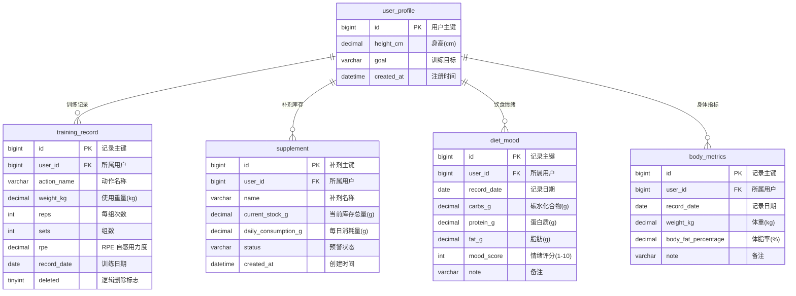
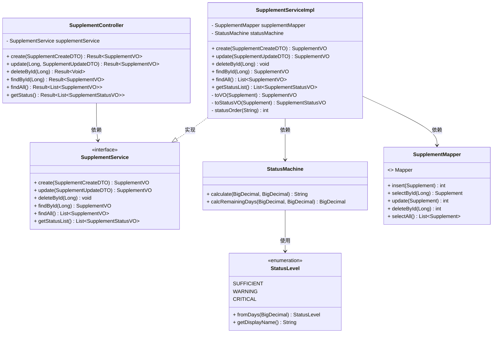

## 数据库设计与类图

### 数据库 E-R 图

> **图注：** IronSync 系统核心 E-R 图。`user_profile` 作为根实体，通过 `user_id` 外键与四张业务表形成一对多关系。`training_record` 采用逻辑删除（`deleted` 标志位）；`diet_mood` 与 `body_metrics` 在 `(user_id, record_date)` 上建有唯一索引，保证每日一条的业务约束。

---

### 补剂状态机核心架构类图

> **图注：** 补剂状态机核心调用链。`SupplementController` 接收 HTTP 请求并委托至 `SupplementService` 接口；`SupplementServiceImpl` 实现业务逻辑，组合 `SupplementMapper` 完成数据持久化，并调用 `StatusMachine` 计算库存预警等级。`StatusMachine` 依赖 `StatusLevel` 枚举通过天数阈值（>30 天充足、7-30 天偏低、<7 天告急）判定状态，实现库存预警规则与业务逻辑的解耦。
